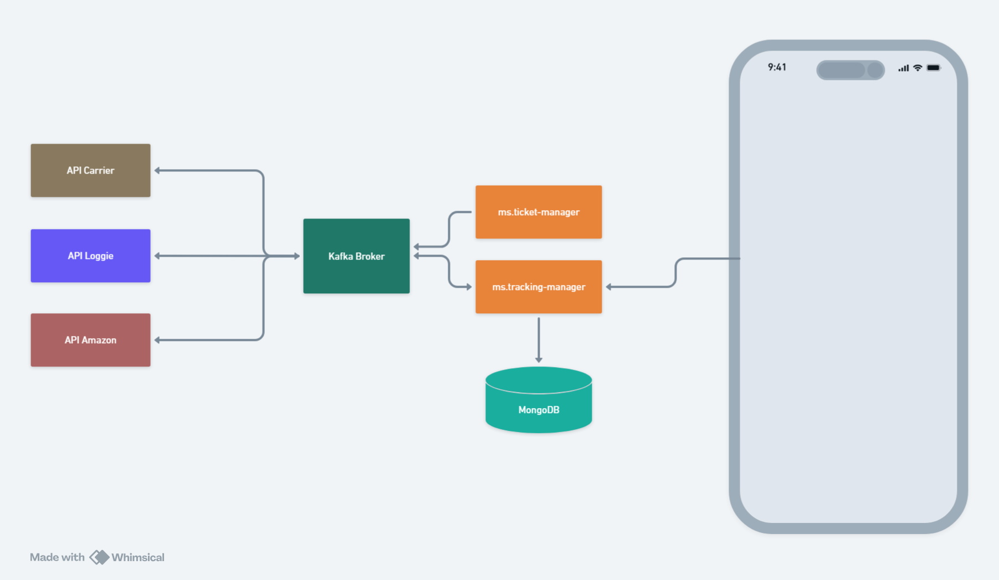

# SmartEnvios Tracking Manager

## :orange_book: ms.carriers

O serviço **ms.carriers** é responsável por interagir com as APIs externas das transportadoras. Ele consulta e obtém eventos de frete, como atualizações de status e localização, a partir das transportadoras. O serviço processa esses eventos e os publica em tópicos do Kafka para serem consumidos por outros componentes do sistema.

## :closed_book: ms.tracking-manager

O serviço **ms.tracking-manager** é o núcleo do sistema de rastreamento. Ele consome os eventos relacionados à criação de pedidos, registra esses pedidos em um banco de dados e determina quais pedidos ainda estão em trânsito. O serviço também é responsável por agendar verificações regulares dos pedidos em andamento, buscar atualizações de rastreio junto ao banco de dados e publicar mensagens no Kafka para solicitar atualizações aos serviços das transportadoras.

## :blue_book: web.tracking-view

O aplicativo web **web.tracking-view** é a interface de usuário para os clientes da SmartEnvios. Ele permite que os clientes visualizem o status e o progresso de seus pedidos em um painel centralizado. O aplicativo consome mensagens do Kafka para atualizar dinamicamente as informações de rastreio exibidas aos clientes. Isso fornece uma maneira eficaz para os clientes acompanharem seus pedidos de diferentes transportadoras em uma única tela, eliminando a necessidade de acessar sistemas separados.

## :triangular_ruler: Arquitetura distribuída

A arquitetura distribuída que envolve o "Tracking Manager" e os serviços das transportadoras, com o uso do Kafka, oferece diversos benefícios significativos:

**Desacoplamento e Escalabilidade**: A utilização do Kafka como intermediário permite que o "Tracking Manager" e os serviços das transportadoras operem de forma independente e desacoplada. Cada componente pode ser escalado vertical ou horizontalmente conforme necessário, sem afetar os outros.

**Comunicação Assíncrona**: O Kafka facilita a comunicação assíncrona entre os componentes. Isso significa que o "Tracking Manager" não precisa esperar por uma resposta imediata dos serviços das transportadoras. Ele publica mensagens e continua seu trabalho, melhorando a eficiência e a latência do sistema.

**Tolerância a Falhas**: A arquitetura distribuída com o Kafka proporciona uma maior resiliência contra falhas. Se um serviço de transportadora ficar indisponível temporariamente, o "Tracking Manager" ainda poderá enviar mensagens para o Kafka, e assim que o serviço estiver de volta, ele poderá consumir as mensagens pendentes.

**Escalabilidade Individual**: Cada serviço de transportadora pode ser escalado de acordo com a demanda específica daquela transportadora, sem afetar os outros componentes. Isso permite uma alocação eficiente de recursos e um melhor aproveitamento dos recursos de hardware.

**Facilitação da Integração**: O Kafka atua como intermediário neutro, facilitando a integração entre sistemas heterogêneos. Isso é especialmente útil quando diferentes transportadoras possuem sistemas com tecnologias variadas.

**Dados Centralizados**: Ao usar tópicos do Kafka, todos os eventos de rastreio e atualizações estão centralizados em um único local, facilitando a análise, o monitoramento e a auditoria.

**Tratamento de Picos de Tráfego**: Em períodos de pico de tráfego, o Kafka atua como um amortecedor, absorvendo picos súbitos de mensagens e distribuindo o processamento ao longo do tempo, evitando sobrecargas nos sistemas.

**Tempo Real e Atualização Contínua**: O sistema baseado em Kafka permite atualizações em tempo real para os eventos de rastreio. Assim que um evento é registrado, o "Tracking Manager" pode consumir essa informação e notificar o cliente quase instantaneamente.

**Compatibilidade de Dados**: O uso do Kafka juntamente com um Schema Registry garante que os diferentes componentes utilizem esquemas de dados compatíveis, facilitando a evolução e a manutenção das interfaces de comunicação.

## :dart: Visão Geral do Projeto: Sistema de Rastreamento de Pedidos de Frete

### Microsserviços de Transportadora:

Cada transportadora opera seu próprio microsserviço dedicado.
O microsserviço consulta APIs externas das transportadoras para obter eventos de frete.
Os eventos de frete são publicados em um tópico central no Kafka relacionado a eventos de rastreio.

### Tracking Manager:

O Tracking Manager consome eventos que indicam que um pedido foi criado.
Ele registra esses pedidos no banco de dados para gerenciar a atualização de rastreio.
A cada 5 minutos, o Tracking Manager busca no banco de dados pedidos com status diferentes de "Entregue" ou "Cancelado" (pedidos ainda em trânsito).
Ele publica uma mensagem no tópico do Kafka indicando a necessidade de atualização de rastreio.

### Microsserviços de Transportadora (Novamente):

Cada microsserviço verifica as mensagens no tópico do Kafka para saber se são destinadas a ele.
Se uma mensagem é para sua transportadora, ele consome a mensagem.
O microsserviço verifica APIs externas para obter atualizações no rastreio e publica uma nova mensagem com as atualizações.

### Atualização de Rastreio:

Cada microsserviço de transportadora recebe uma mensagem do Kafka para determinar se precisa buscar atualizações de rastreio.
Quando uma atualização é obtida, o microsserviço publica uma mensagem no tópico do Kafka, indicando a conclusão da atualização.
O Tracking Manager consome essa mensagem, atualiza os eventos de rastreio no banco de dados e notifica o cliente de que o rastreio foi atualizado com sucesso.

### Painel de Acompanhamento:

Os pedidos podem ser visualizados por meio de um painel centralizado.
Isso elimina a necessidade de atualizações manuais de frete.
Os clientes da SmartEnvios podem acompanhar facilmente seus pedidos de diferentes transportadoras em uma única tela, simplificando a experiência.

### Benefícios:

Automação: O sistema automatiza o rastreamento de pedidos e eventos de frete, eliminando tarefas manuais e erros humanos.
Tempo de Resposta: Os eventos de rastreio são atualizados rapidamente, proporcionando uma visão em tempo real do status dos pedidos.
Centralização: O painel de acompanhamento oferece uma visão unificada de pedidos de diferentes transportadoras.
Eficiência: A comunicação via Kafka permite que os microsserviços se comuniquem eficientemente, mesmo em escala.
Em resumo, o sistema fornece uma solução eficaz e automatizada para rastreamento de pedidos e eventos de frete, melhorando a experiência do cliente e otimizando as operações de logística.

## :mag: Observabilidade no Projeto: Garantindo Visibilidade e Entendimento

A observabilidade no projeto é a capacidade de entender e monitorar a saúde, desempenho e comportamento dos microsserviços, sistemas e processos que compõem a solução de rastreamento de pedidos e eventos de frete. Por meio de práticas e ferramentas específicas, busca-se obter insights detalhados sobre o estado do sistema em tempo real, facilitando a detecção precoce de problemas, o diagnóstico preciso de falhas e a otimização contínua da experiência do usuário.

### Principais Componentes de Observabilidade Utilizados:

**Logs**: A geração e armazenamento de logs detalhados permitem o registro de eventos relevantes, erros e atividades no sistema. Isso ajuda na identificação e análise de problemas, fornecendo um histórico de eventos para auditoria e resolução de problemas.

**Métricas**: A coleta de métricas de desempenho, como tempos de resposta, taxas de erros e utilização de recursos, oferece uma visão quantificável do sistema. As métricas permitem monitorar a saúde e identificar tendências, auxiliando na otimização e no dimensionamento adequado.

**Tracing**: O rastreamento de transações e chamadas entre microsserviços ajuda a entender a jornada de uma solicitação através do sistema. Isso é crucial para identificar gargalos de desempenho e compreender o fluxo de dados.

**Monitoramento em Tempo Real**: A observação em tempo real de métricas, eventos e comportamentos do sistema permite detectar anomalias e tomar medidas imediatas. Isso contribui para a manutenção proativa e a minimização do tempo de inatividade.

**Ferramentas de APM**: Ferramentas de APM, como o Elastic APM, permitem rastrear a performance das aplicações e seus componentes, identificando gargalos e melhorias potenciais.

**Ferramentas de Visualização de Dados**: Plataformas de visualização, como o Kibana, permitem criar painéis interativos para monitorar métricas, gráficos de eventos e facilitar a análise dos dados coletados.

### Benefícios da Observabilidade:

Identificação Proativa de Problemas: A observabilidade permite identificar e resolver problemas antes que eles afetem os usuários finais, melhorando a confiabilidade do sistema.

Aprimoramento Contínuo: Os insights obtidos da observabilidade possibilitam ajustes e otimizações contínuas, resultando em um sistema mais eficiente e responsivo.

Resposta Rápida a Incidentes: A detecção rápida de anomalias e eventos adversos permite uma resposta ágil a incidentes, minimizando o impacto.

Melhoria na Experiência do Usuário: Ao garantir a disponibilidade e o desempenho, a observabilidade contribui para uma experiência de usuário mais consistente e positiva.

Em resumo, a observabilidade é essencial para entender e aprimorar a operação de sistemas complexos, garantindo que as equipes de desenvolvimento, operações e suporte tenham insights valiosos para manter um ambiente confiável e de alto desempenho.

## :microscope: Tecnologias utilizadas

**Node.js**: Plataforma de tempo de execução JavaScript que permite executar código JavaScript do lado do servidor, proporcionando um ambiente adequado para desenvolver microsserviços eficientes.

**Kafka**: Plataforma de streaming distribuída que permite a transmissão de mensagens entre microsserviços e sistemas em tempo real, facilitando a comunicação assíncrona e a integração de diferentes partes do sistema.

**Jest**: Framework de testes em JavaScript que é usado para testar unidades individuais de código. Ele oferece suporte a testes de unidade, testes de integração e testes de snapshot.

**React**: Biblioteca JavaScript para construção de interfaces de usuário interativas e dinâmicas. É usada para criar o painel de acompanhamento do usuário, permitindo uma experiência de usuário rica e responsiva.

**Docker**: Plataforma de virtualização que permite empacotar aplicativos e suas dependências em contêineres isolados. Isso facilita a implantação consistente e escalonável de aplicativos em ambientes diferentes.

**Elastic Stack**: Também conhecido como ELK Stack, é um conjunto de ferramentas que inclui o Elasticsearch (para pesquisa e análise de dados), o Logstash (para coleta, processamento e enriquecimento de dados) e o Kibana (para visualização de dados).

**Schema Registry**: Componente que permite gerenciar e armazenar esquemas de dados no formato AVRO, garantindo a compatibilidade entre diferentes versões de esquemas usados na comunicação entre microsserviços.

**PostgreSQL**: Sistema de gerenciamento de banco de dados relacional de código aberto que é usado para armazenar e gerenciar dados persistentes do aplicativo.

**Express**: Framework web para Node.js que simplifica a criação de APIs RESTful e aplicativos web, fornecendo um conjunto de recursos para lidar com roteamento, middlewares e muito mais.
